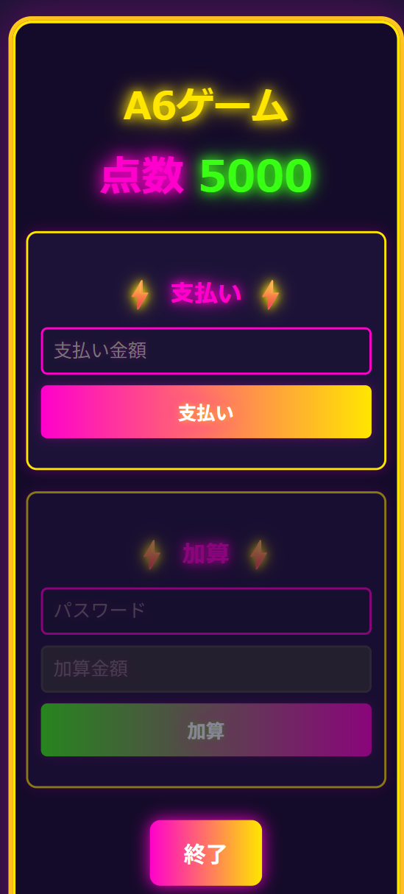

# 点数管理アプリ

## 1.目的・概要
[弟の文化祭で使用するゲームの点数管理アプリを作成]

## 2.機能
- [初期値の得点を持つ5000点]
- [使いたい得点を入力し「支払う」を押すと支払いができる]
- [パスワードを入力し、追加したい得点を入力し「加算」を押すと加算ができる]

## 3.使用技術
- [HTML, CSS ,Javascript(Vanilla)のみ]
- [GithubPagesで公開]

## 4. 実際の活用イメージ

